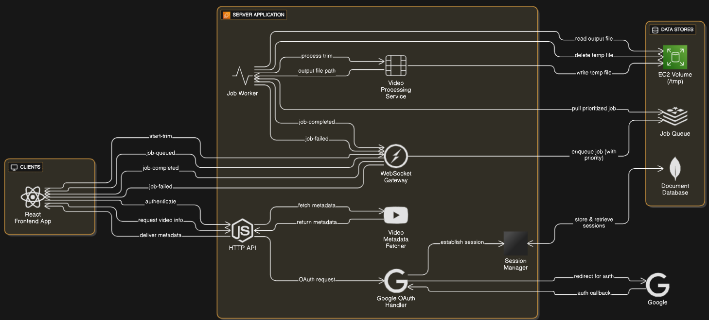

```
██╗   ██╗ ██████╗ ██████╗ ████████╗███████╗██╗  ██╗
██║   ██║██╔═══██╗██╔══██╗╚══██╔══╝██╔════╝╚██╗██╔╝
██║   ██║██║   ██║██████╔╝   ██║   █████╗   ╚███╔╝ 
╚██╗ ██╔╝██║   ██║██╔══██╗   ██║   ██╔══╝   ██╔██╗ 
 ╚████╔╝ ╚██████╔╝██║  ██║   ██║   ███████╗██╔╝ ██╗
  ╚═══╝   ╚═════╝ ╚═╝  ╚═╝   ╚═╝   ╚══════╝╚═╝  ╚═╝
```

- Vortex is a web app that lets you download and trim video clips from YouTube directly from a link. Bull mq to allow trim and download for long videos.WebSockets to send real-time job status updates to the user.Deployed Using AWS EC2 Instance.

## Architecture

This diagram illustrates the architecture of the Vortex application, featuring a real-time WebSocket interface, a prioritized job queue (BullMQ/Redis), and an integrated worker process for handling video processing tasks.

