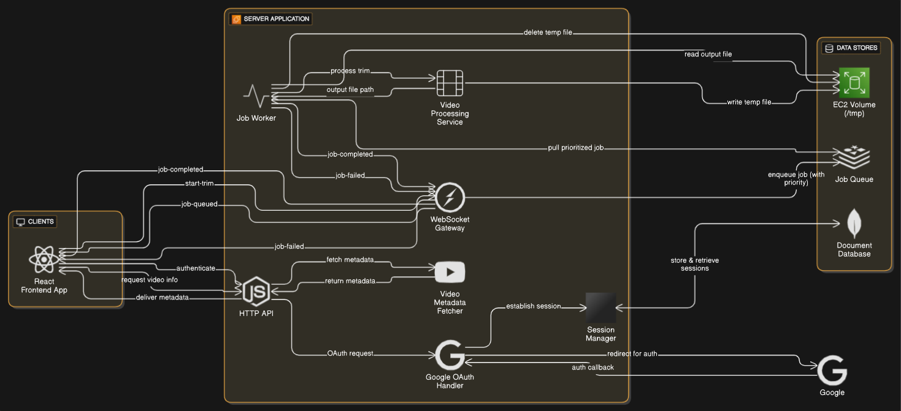
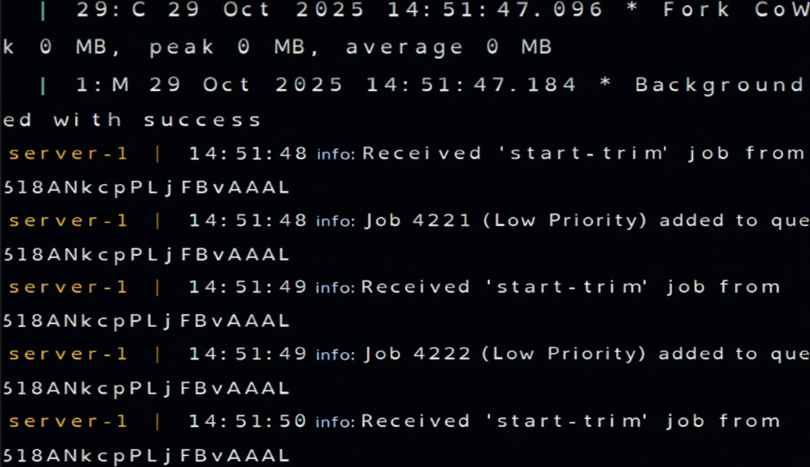

# Vortex Video Toolkit

Vortex is a full-stack video processing application designed to trim clips from various social media platforms (like X and Instagram). It's built as a scalable, multi-process monolith to efficiently handle heavy processing tasks without blocking the user interface.

This project showcases a powerful backend architecture using a worker queue, real-time updates via WebSockets, centralized logging with Winston, and a modern React frontend.

## Features

- **Secure Google OAuth**: Full authentication flow using Passport.js
- **Server-Side Video Processing**: Fetches info and trims videos from X and Instagram URLs
- **Distributed Job Queue**: Uses BullMQ and Redis to offload heavy yt-dlp processing to a separate worker, keeping the API fast and responsive. Also uses BullMQ built-in methods to assign "High" or "Low" priority to trim jobs based on their length for a better user experience
- **Real-Time Progress**: Uses WebSockets (socket.io) to send live job status updates from the server to the client (e.g., "Queued," "Processing," "Completed")
- **Centralized Logging**: Winston logger deployed across the entire application for tracking errors, info, and system events in both the API server and worker processes
- **Automated Cleanup**: A recurring Cron Job automatically runs to delete old video files from the server's temporary storage
- **API Security**: Implements express-rate-limit to protect API endpoints from spam and abuse

## Demo

[A brief demonstration of the application on YouTube](https://www.youtube.com/watch?v=OnjxbqGcHFo)

## Architecture: A Multi-Process Monolith

The core of this project is its **multi-process monolith architecture**. While it's a single application (a "monolith") deployed from one codebase, it runs as separate, decoupled processes (API server and Worker). This pattern separates the main API from heavy, long-running tasks, ensuring the app is scalable and responsive.

This architecture is the first step toward a true microservices system, as the API (Job Producer) and the Worker (Job Consumer) only communicate via a third-party message broker (Redis).



## Queue Benchmarks :

Successfully tested the bullmq queue to deal with 4000+ jobs across 5 seconds which translates to approximately 800 jobs per second.



### 1. Backend API (Express Server)

This is the "brain" of the operation. It's a Node.js server that handles all client-facing requests. Its job is to be fast and light.

- **Handles Auth**: Manages Google OAuth login and user sessions
- **Handles API Requests**: Serves video info from yt-dlp
- **Handles WebSockets**: Manages real-time connections with users
- **Queues Jobs**: When a user requests a video trim, this server does not do the work. It creates a "job" and instantly adds it to the BullMQ queue, then tells the user "Your job is queued!" This keeps the API from ever timing out or blocking
- **Logs Events**: Uses Winston to log all incoming requests, authentication events, errors, and API responses for debugging and monitoring

### 2. Redis & BullMQ (The "Factory")

This is the heart of the system.

- **Redis** acts as the central message broker, holding the list of all "to-do" trim jobs
- **BullMQ** is the "factory manager" (job queue system) that organizes the work

#### Why use a Job Queue?

Video processing can take 30 seconds or more. An HTTP request will time out, and it will block the server for other users. By using a queue, the API can accept 1,000 requests in one second and just add them to the "to-do" list. The app feels instant.

#### Why use Priority Queues?

In this project, trim jobs are given a **High Priority** or **Low Priority** based on their duration:

- **Short clips** (e.g., under 5 minutes) get `priority: 1` so they are processed first
- **Long clips** (e.g., 10 minutes) get `priority: 2` so they don't make other users wait

This ensures a snappy user experience for the most common (short) requests.

### 3. The BullMQ Worker

This is the "heavy lifter" of the factory. In this project's `docker-compose.yml`, this is run as a completely separate Node.js process in its own Docker container.

- Its only job is to connect to Redis, ask for a job from the queue, and process it
- It runs the `yt-dlp` and `ffmpeg` commands to perform the actual video trimming
- It updates the job's progress (e.g., "processing", "completed") in Redis, which the API server then sees and broadcasts to the user via WebSocket
- **Logs Processing**: Uses Winston to log job start/completion times, processing errors, ffmpeg output, and any failures for troubleshooting

### 4. WebSockets (socket.io)

WebSockets are used to provide a real-time, push-based experience, which is much better than forcing the user to refresh.

- When a user connects, they join a "room" on the WebSocket server
- When a worker updates a job's status, it emits an event
- The API server "listens" for these events and broadcasts the status (`job-queued`, `job-processing`, `job-completed`) to the specific user in their "room"

### 5. Cron Jobs & Rate Limiting

Two key features ensure the server is stable and secure:

- **Rate Limiting**: `express-rate-limit` is used on the API to prevent spam. It limits users to 25 requests per 15 minutes
- **Cron Jobs**: A BullMQ "repeatable job" is set up to run every 10 minutes. This job runs a cleanup function that deletes any trim files from the server's temporary storage that are older than 10 minutes, ensuring the server's SSD never fills up

### 6. Centralized Logging with Winston

Winston is configured across both the API server and worker processes to provide unified logging:

- **Structured Logging**: All logs are formatted with timestamps, log levels (error, warn, info, debug), and contextual metadata
- **Multiple Transports**: Logs are written to both console (for development) and files (for production debugging)
- **Error Tracking**: Critical errors in video processing, authentication failures, and system issues are logged with full stack traces

## Local Development Setup

This project is fully containerized with Docker for easy and consistent local development.

### Prerequisites

- Node.js (v18+)
- Docker & Docker Compose
- Git

### 1. Clone the Repository

```bash
git clone https://github.com/aryan55254/Vortex.git
cd Vortex
```

### 2. Set Up Environment Variables

You must create `.env` files for both the frontend and backend.

#### For the Backend:

1. Navigate to the server folder: `cd server`
2. Copy the example file: `cp .env.example .env`
3. Open the new `server/.env` file and fill in all your secrets:

```env
# --- Server Port ---
PORT=8080

# --- Redis Configuration ---
# Must match docker-compose.yml
REDIS_HOST=redis
REDIS_PORT=6379
REDIS_PASSWORD=mish3791 # Or your chosen password

# --- Domain Configuration ---
CLIENT_URL=http://localhost:5173
SERVER_URL=http://localhost:8080

# --- Your Secrets ---
MONGO_URI=...YOUR_MONGO_URI...
SESSION_SECRET=...YOUR_SESSION_SECRET...
GOOGLE_CLIENT_ID=...YOUR_GOOGLE_CLIENT_ID...
GOOGLE_CLIENT_SECRET=...YOUR_GOOGLE_CLIENT_SECRET...

# --- Node Env ---
NODE_ENV=development
```

**Important**: In your `docker-compose.yml` (in the root Vortex folder), make sure the Redis command password matches your `REDIS_PASSWORD`.

#### For the Frontend:

1. Navigate to the frontend folder: `cd ../frontend`
2. Copy the example file: `cp .env.example .env`
3. Open the new `frontend/.env` file and fill in the API URL:

```env
VITE_BaseAPI=http://localhost:8080
```

### 3. Build and Run the Application

You'll need two separate terminals.

#### Terminal 1: Start the Backend (Docker)

From the root Vortex folder:

```bash
# This builds and starts the server and redis containers
docker-compose up --build
```

Your entire backend (API, Worker, and Redis) is now running.

#### Terminal 2: Start the Frontend

From the frontend folder (`cd frontend`):

```bash
# Install frontend dependencies
npm install

# Start the dev server
npm run dev
```

### Your application is now running!

- **Frontend**: http://localhost:5173
- **Backend**: http://localhost:8080

## Project Structure

This project is a monorepo containing two main packages: `frontend` and `server`.

```
Vortex/
├── frontend/                    # Vite + React + TypeScript application
│   ├── src/
│   ├── public/
│   ├── .env
│   └── package.json
│
├── server/                      # Node.js + Express + TypeScript backend
│   ├── src/
│   │   ├── config/              # Configuration files
│   │   │   └── (Winston, Redis, DB configs)
│   │   │
│   │   ├── controllers/         # Request handlers
│   │   │   ├── socket.handler.ts
│   │   │   └── video.controller.ts
│   │   │
│   │   ├── middlewares/         # Express middlewares
│   │   │   ├── auth.middleware.ts
│   │   │   └── errorhandler.middleware.ts
│   │   │
│   │   ├── models/              # Database models
│   │   │   └── User.model.ts
│   │   │
│   │   ├── Queue/               # BullMQ queue setup
│   │   │   └── queue.ts
│   │   │
│   │   ├── routes/              # API route definitions
│   │   │   ├── auth.routes.ts
│   │   │   └── video.routes.ts
│   │   │
│   │   ├── services/            # Business logic
│   │   │   └── video.service.ts
│   │   │
│   │   ├── types/               # TypeScript type definitions
│   │   │   └── types.ts
│   │   │
│   │   ├── utils/               # Helper utilities
│   │   │   └── logger.ts        # Winston logger instance
│   │   │
│   │   └── index.ts             #    MAIN ENTRY POINT - App initialization,
│   │                            #    server setup, middleware registration,
│   │                            #    route mounting, DB connection, Redis setup
│   │
│   ├── .dockerignore
│   ├── .env
│   ├── Dockerfile
│   └── package.json
│
├── docker-compose.yml           # Orchestrates API, Worker, and Redis
├── .gitignore
└── README.md

```

- `/frontend`: A self-contained Vite + React + TypeScript application
- `/server`: A self-contained Node.js + Express + TypeScript backend. It contains its own Dockerfile and logic for the API, worker, queues, and centralized Winston logging
- `docker-compose.yml`: (In root) The master file used to orchestrate and run the entire backend system (`vortex-server` and `redis`) locally

## Tech Stack

**Frontend:**

- React + TypeScript
- Vite
- Socket.io-client
- TailwindCSS

**Backend:**

- Node.js + Express + TypeScript
- Passport.js (Google OAuth)
- BullMQ + Redis
- Socket.io
- Winston (Logging and Info)
- yt-dlp + ffmpeg
- MongoDB (Session storage)

**Infrastructure:**

- Docker & Docker Compose
- Redis (Message Broker)

---

Built with ❤️ by Aryan.
