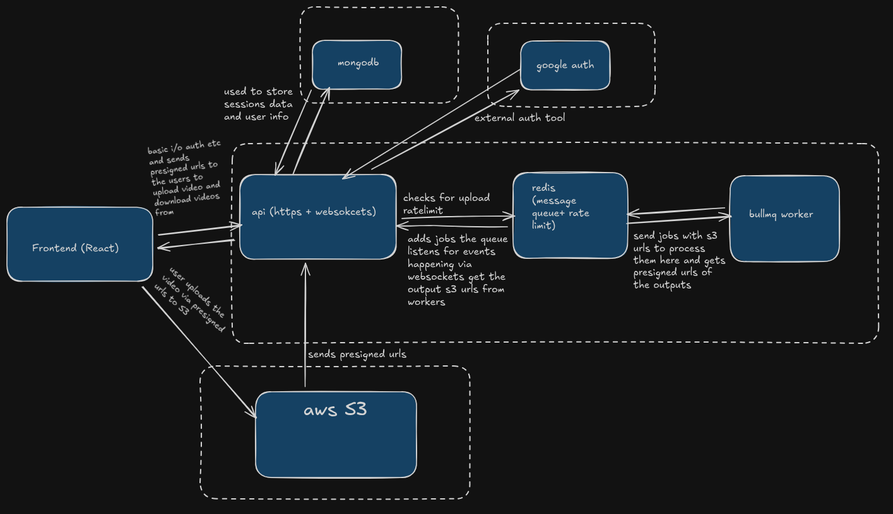

# VORTEX VIDEO TOOLKIT

Vortex is a modular monolithic video processing platform built to handle heavy FFmpeg workloads using a decoupled queue-driven architecture. It supports real-time progress updates, secure file processing pipelines, and scalable background workers powered by BullMQ and Redis.
The platform is fully containerized using Docker, deployed on AWS (EC2 + S3), and includes authentication, WebSocket-based job state tracking and automated file cleanup.

---
## Live

Live On : [Vortex](https://vortex.aryanmishra.site)

## Features

- Secure Direct AWS S3 Uploads
- Decoupled Processing Model with BullMQ Worker System
- Real-Time WebSocket Status Updates
- Automatic File Reaper for stale temporary storage cleanup
- Session-Based Authentication with Google OAuth
- Admin Queue Monitoring via Bull Board
- Docker-Based Services (API, Worker, Redis)
- Production Deployment on AWS (EC2 + SSL)
- MongoDB Storage for user and processing metadata
- Graceful shutdown for the worker

---

## Architecture



## Project Structure

```
vortex
│
├── frontend/                    # React client
├── public/                      # Static files
└── server/
│     ├── src/
│     │   ├── common/             # Shared config, utils, middleware
│     │   │   ├── config/
│     │   │   ├── middlewares/
│     │   │   └── utils/
│     │   ├── modules/
│     │   │   ├── auth/
│     │   │   └── video/
│     │   ├── http-server.ts      # Express entrypoint
│     │   ├── worker.ts           # Worker instance for BullMQ
│     │   ├── Dockerfile.api
│     │   └── Dockerfile.worker
│     │
└── docker-compose.yml

```

---

## Local Setup

### 1. Install Dependencies

```
cd server && npm install
cd ../frontend && npm install
```

### 2. Create Environment File

Copy `.env.example` to `.env` and configure like this :

```

# Server Configuration
PORT=8080
SERVER_URL="http://localhost:8080"
NODE_ENV="development"

# Database
MONGO_URI="your_mongo_uri"

# Session Security
SESSION_SECRET="your_secret_session_key"

# Google OAuth Credentials
GOOGLE_CLIENT_ID="_your_credentials_from_google_cloud_console"
GOOGLE_CLIENT_SECRET="_your_credentials_from_google_cloud_console"

# Client Side URL
CLIENT_URL="http://localhost:5173"

# Redis
REDIS_HOST="redis"
REDIS_PORT="6173:6173"
REDIS_PASSWORD="your_password"

# AWS S3
S3_ENDPOINT="if_using_minio_locally_otherwise_don't_add"
S3_BUCKET_NAME="_your_bucket_name"
S3_ACCESS_KEY="_your_s3_credentials"
S3_SECRET_KEY="_your_s3_credentials"
S3_REGION="_your_nearest_aws_region"

```

### 3. Run Using Docker (Recommended)

```
docker compose up --build
```

Services started:

| Service       | Port   | Purpose               |
| ------------- | ------ | --------------------- |
| vortex-api    | `8080` | REST API + WebSockets |
| vortex-worker | —      | Video processing      |
| redis         | `6379` | BullMQ backend        |

### 4. Start Frontend

```
cd frontend
npm run dev
```

---
**Setup Guide:**
1. **MongoDB:** Create a free cluster at [MongoDB Atlas](https://www.mongodb.com/cloud/atlas)
2. **Google OAuth:** Get credentials from [Google Cloud Console](https://console.cloud.google.com/)
3. **AWS S3:** Create a bucket in [AWS Console](https://console.aws.amazon.com/s3/)

## Tech Stack

### Backend

- Node.js
- TypeScript
- Express
- BullMQ with Redis
- MongoDB & Mongoose
- Passport.js Authentication
- Socket.IO
- FFmpeg processing pipeline

### Frontend

- React
- TypeScript
- TailwindCSS
- Axios
- Socket.io Client

### Infrastructure

- Docker & Docker Compose
- AWS EC2 & S3
- SSL (Certbot or ACM)
- NGINX

---

## Deployment Notes

The platform is deployed on AWS EC2 with Docker containers for the API, worker, and Redis.
S3 storage handles both uploaded source media and processed outputs.
SSL certificates are configured for secure connection between frontend and backend.

---